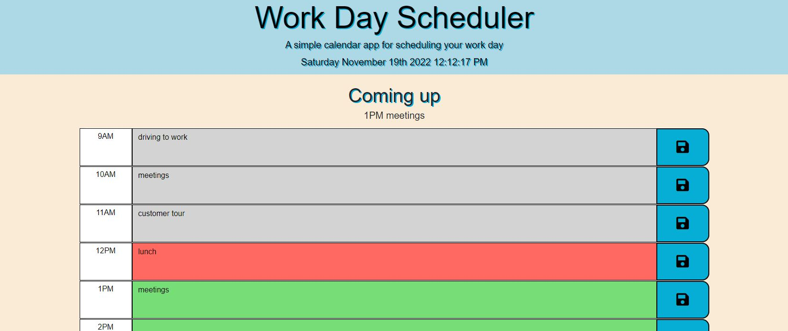

# Module5Challenge - Third-Party APIs

## Description

Bootcamp: Module 5 Challenge  
Third-Party APIs: Work Day Scheduler  
Codebase correction that follows accessibility standards so that the site is optimized for search engines

## Table of Contents (Optional)

N/A

## Installation

Github pages hosting: https://fjnelson.github.io/Module5Challenge/

## Usage

## Credits

Credits for contributions: https://github.com/mmeii/work-day-scheduler
Mmeii on January 19th, 2021

Credits for contributions: https://github.com/sylviaprabudy/work-day-scheduler
sylviaprabudy on June 21, 2020

## License

Please refer to the LICENSE in the repo.